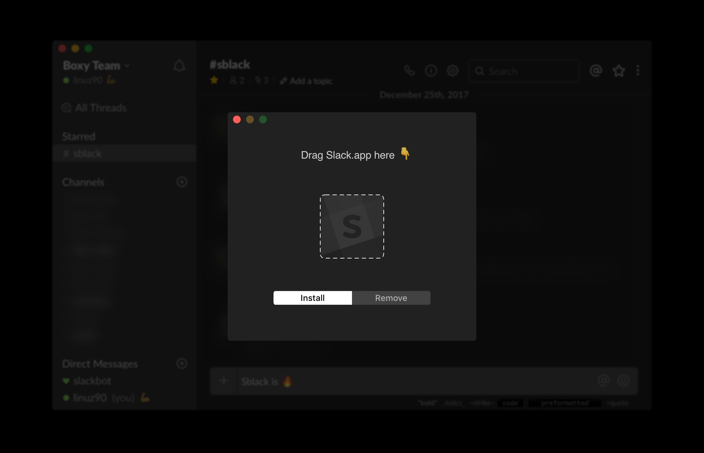

FOLLOW INSTRUCTIONS HERE: https://github.com/frankdilo/sblack/issues/15

⚠️ Sblack is <strong>no longer available for download</strong> since the app is in violation of the Slack Acceptable Use Policy. It was fun while it lasted, sorry guys!

# Sblack &nbsp;

> Sblack makes [Slack for Mac](https://slack.com/downloads/osx) easier on your eyes.
> Just drag and drop and you're done ✨
>
> Made for all the people that, like us, use Slack all day long.

Developed by [Francesco Di Lorenzo](http://www.twitter.com/frankdilo) and designed by [Fabrizio Rinaldi](http://www.twitter.com/linuz90)

## Install and Usage

- ~Download Sblack~ (no longer available)
- Open the app
- Drag `Slack.app` onto it
- Boom, done!

## How to Contribute

If you want to improve the theme, this is the process:

- Clone the repo
- Install the theme
- Open `/Applications/Slack/Contents/Resources/app.asar.unpacked/src/static/ssb-interop.js`
- Down below in that file you will find the css that makes the theme
- Edit it (relauch Slack.app to see the changes)
- Report the edits to the css file in this repo

You can enable "Inspect Element" in Slack for Mac by launching the app this way from the terminal:

```sh
SLACK_DEVELOPER_MENU=1 /Applications/Slack.app
```

## Related

- [Official Website](http://www.sblack.online)
- [Slack Night Mode](https://github.com/laCour/slack-night-mode) - Original CSS used to make Slack dark.

## Preview



## License

MIT © [Francesco Di Lorenzo](http://frankdilo.xyz)

> Permission is hereby granted, free of charge, to any person obtaining a copy of this software and associated documentation files (the "Software"), to deal in the Software without restriction, including without limitation the rights to use, copy, modify, merge, publish, distribute, sublicense, and/or sell copies of the Software, and to permit persons to whom the Software is furnished to do so, subject to the following conditions:
>
> The above copyright notice and this permission notice shall be included in all copies or substantial portions of the Software.
>
> THE SOFTWARE IS PROVIDED "AS IS", WITHOUT WARRANTY OF ANY KIND, EXPRESS OR IMPLIED, INCLUDING BUT NOT LIMITED TO THE WARRANTIES OF MERCHANTABILITY, FITNESS FOR A PARTICULAR PURPOSE AND NONINFRINGEMENT. IN NO EVENT SHALL THE AUTHORS OR COPYRIGHT HOLDERS BE LIABLE FOR ANY CLAIM, DAMAGES OR OTHER LIABILITY, WHETHER IN AN ACTION OF CONTRACT, TORT OR OTHERWISE, ARISING FROM, OUT OF OR IN CONNECTION WITH THE SOFTWARE OR THE USE OR OTHER DEALINGS IN THE SOFTWARE.
